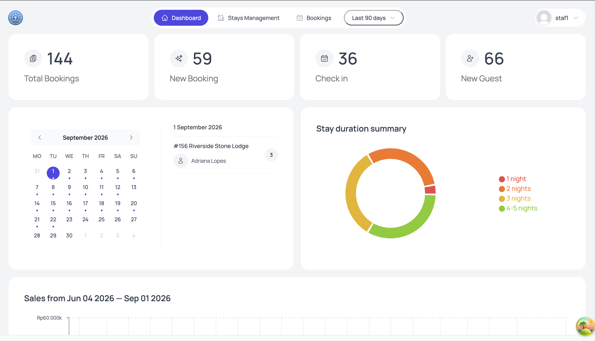
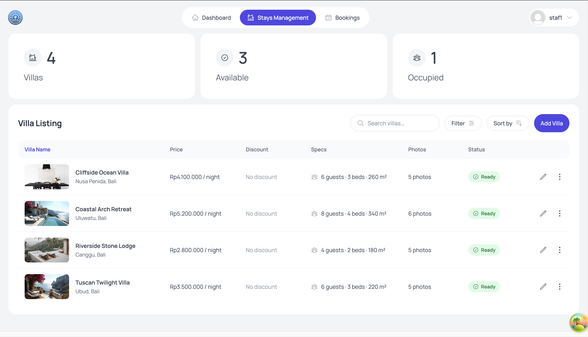
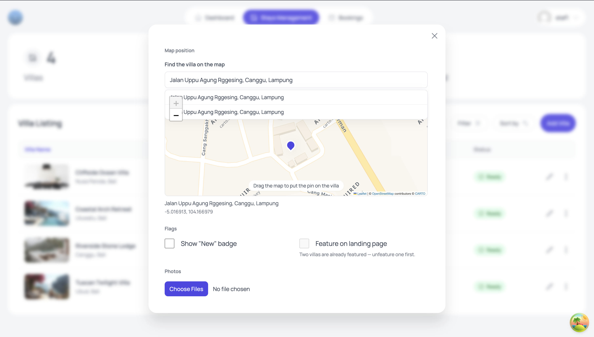
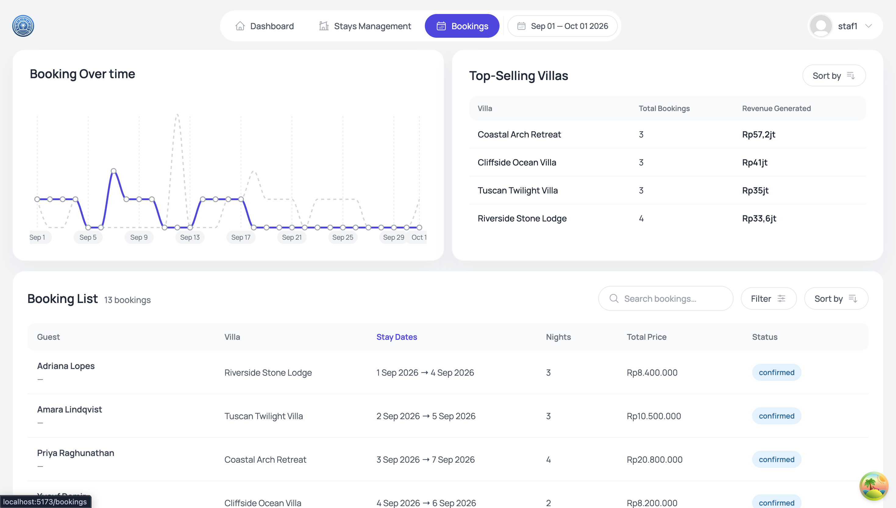

# Seaspace Admin Panel

[](https://seaspace-track-app.vercel.app)


Internal admin panel for managing the villa catalogue behind the **Seaspace** villa-booking
site. It's a staff-only tool — not a customer-facing product — used to create and edit villas,
upload and manage their photos, manage shared and per-villa amenities, and review bookings and
guest activity. It talks to the same Supabase project as the public booking site, but the two
are entirely separate codebases connected only through the database.

> **Note on the live demo:** the app is behind a staff login. Reaching the dashboard requires
> a Supabase account that has a matching row in `public.staff` — see
> [Authorization model](#authorization-model) for why that row is what grants access.

## Screenshots

### Dashboard

Booking stats, occupancy snapshot, and the sales/bookings charts — the landing screen after
login.



### Stays — the villa catalogue

Sortable, filterable list of villas, and the create/edit form with its image uploader and
map-based location picker (place search plus a draggable pin, so coordinates are never typed
by hand).





### Bookings

Guest bookings with sorting, filtering, and financial summaries.



## Tech stack

- **React 19** + **TypeScript** (strict mode) — single-page app, no server/SSR runtime
- **Vite 6** (`@vitejs/plugin-react-swc`) — build tool
- **react-router-dom v7** — data router (`createBrowserRouter`)
- **@tanstack/react-query v5** — server-state management and caching. There is no global
  client-state library (no Redux, no Zustand); everything else is local component state or
  scoped React Context.
- **styled-components v6** — styling. The public customer site uses Tailwind; this repo
  deliberately does not, to keep the two codebases' styling conventions from bleeding into
  each other.
- **react-hook-form + zod** — forms and validation. Each Zod schema doubles as the TypeScript
  type via `z.infer<>`, so validation rules and types can't drift apart.
- **Supabase** (`@supabase/supabase-js`) — Postgres, Auth, and Storage, accessed with the
  anon/publishable key plus a logged-in staff session. Write access comes from Row-Level
  Security policies, not from a privileged key — see [Authorization model](#authorization-model).
- **react-leaflet** — interactive map for setting a villa's location
- **recharts** — dashboard charts
- **react-hot-toast**, **react-error-boundary** — feedback and error handling

## Features

- **Dashboard** — booking stats, occupancy snapshot, and sales/bookings charts
- **Stays (villa catalogue)** — create and edit villas, upload and manage photos (with an
  automatic image pipeline: resize, EXIF-safe rotation, WebP encoding, blur placeholder
  generation), pick a location via place search + draggable map pin, manage amenities, sort and
  filter the villa list
- **Bookings** — table of guest bookings with sort/filter and financial summaries
- **Check-in / Check-out** — guest check-in flow
- **Account** — staff profile, avatar, password management
- **Staff-gated access** — a Supabase account only reaches the panel if it has a row in
  `public.staff` (enforced by database policy, not just the UI)

## Authorization model

This panel is one half of a two-repo system. The other half is the public Seaspace booking
site — a separate codebase that neither imports from this one nor is imported by it. The only
thing they share is a Supabase project, so the boundary between them is enforced in the
database rather than in application code. Everything in this section is that boundary.

### What this app is allowed to write

| Writable                                              | Never written by this app                              |
| ----------------------------------------------------- | ------------------------------------------------------ |
| `stays`, `stay_images`, `amenities`, `stay_amenities` | `auth.users`                                           |
| the `stays` storage bucket                            | `public.guests`, the `guests` bucket                   |
|                                                       | `public.reviews`, `public.bookings`                    |
|                                                       | `public.staff` (rows are created by hand by the owner) |

The admin panel does not create accounts, guests, or bookings. Those belong entirely to the
customer site's own signup and checkout flows: a `guests` row is created by a signup trigger
and its primary key **is** the `auth.users` id, and `bookings` has no `INSERT`/`UPDATE`/`DELETE`
policy at all — even the customer site writes it only through `security definer` functions.
There is no code path anywhere in `src/` that writes to those tables.

There is one narrow read-only exception: three `security definer` functions
(`admin_booking_roster()`, `admin_guest_nationality_stats()`, `admin_export_guests()`) let a
valid staff session read limited guest data for the Bookings and Check-in screens, without
opening up `public.guests` itself. The write ban is unaffected.

### Why the anon key, not a service-role key

This is a pure SPA with no server runtime — there is nowhere to hide a secret. A service-role
key bypasses Row-Level Security entirely, and in an app like this it would necessarily ship
inside the browser bundle, which is the single most dangerous option available. So instead:

- Staff log in as ordinary Supabase users.
- Every write policy on the four catalogue tables checks the session's `auth.uid()` against
  `public.staff`.
- The `stays` bucket is opened to staff sessions in the same migration.

The result is that the boundary above is **enforced by the database**, not merely agreed to.
A staff session that tries to write `bookings` is genuinely rejected.

### One tier, and one sharp edge

Membership in `public.staff` is the entire permission model. There are no tiers inside it: a
staff session may insert, update and delete every catalogue table, and upload, replace and
delete files in the `stays` bucket. Rows are provisioned by hand by the project owner, so the
list stays small and every account on it is trusted with the whole panel.

Deleting still reaches further than editing — removing a villa cascades to its images and
amenities and silently detaches its reviews (`reviews.stay_id` is `on delete set null`), and an
`amenities` row can be shared across every villa — but that is a reason for a confirmation
dialog, not for a second role.

**The sharp edge:** an unauthorized write returns *zero rows affected*, not an error. A signed-in
user with no `public.staff` row would see a silent "success" with nothing changed. That is why
`StaffOnlyRoute` and the hidden nav links exist — RLS is the real security boundary, and the UI
layer exists so the user is never shown an action that will quietly do nothing.

### Two behaviours that look like bugs but aren't

- **A villa with bookings cannot be deleted.** `bookings.stay_id` is `on delete restrict`, so
  Postgres raises a foreign-key error. Treat it as a business rule and surface it in the UI —
  don't debug it.
- **Changes are not visible on the customer site right away.** That site is prerendered and
  cached, currently on a time-based revalidation of up to **1 hour**. An on-demand webhook is
  planned but not built yet, so the timer is the only mechanism today. This is by design: the
  customer site is an image-heavy marketing page serving thousands of visitors, and disabling
  its cache would trade their page speed for one admin's freshness.

### Two rules for writing data

- **Every image row must have `blur_data_url`, `width`, and `height`.** The customer site
  renders villa photos with a blur placeholder and fixed dimensions; a row missing any of the
  three crashes that villa's page. The upload pipeline in this app fills all three.
- **Changing a `slug` changes the villa's public URL.** Existing links break. Warn in the edit
  UI, or lock the field once a villa is published.

## Project structure

```
src/
├── features/            # feature-based modules: authentication, bookings,
│                         # check-in-out, dashboard, stays — each with its own
│                         # components/, hooks/, services/, types/
├── pages/                # route-level components (Dashboard, Bookings, Stays, Checkin, ...)
├── ui/                   # generic, cross-feature UI components (Modal, Table, Menus, ...)
├── hooks/                # generic cross-feature hooks
├── shared/utils/         # generic utilities
├── styles/               # global styles, breakpoints
└── supabase/             # Supabase client + generated database types + migrations
```

Each feature module follows the same internal layering: `services/` (Supabase calls) →
`hooks/` (React Query wrappers) → `types/` (Zod schemas as the single source of truth for
validation and TypeScript types) → `components/`.

## Getting started

### Prerequisites

- Node.js and npm
- A Supabase project with the `stays` / `stay_images` / `amenities` / `stay_amenities` schema
  and a `public.staff` row for the account you'll log in with. Without that row, login
  succeeds but every write is rejected — the most common cause of "saving a villa always
  fails even though the data is correct".

### Install

```bash
npm install
```

### Environment variables

Create a `.env` file at the project root (there is no `.env.example` in the repo yet):

```
VITE_SUPABASE_URL=your-supabase-project-url
VITE_SUPABASE_KEY=your-supabase-anon-key
```

Both are read through `import.meta.env.*`. The `VITE_` prefix is a Vite requirement — without
it, the variable is not exposed to the client bundle at all.

`VITE_SUPABASE_KEY` is the **anon/publishable key**, not the service-role key. This is
deliberate and settled, not a placeholder: see
[Why the anon key, not a service-role key](#why-the-anon-key-not-a-service-role-key). Never put
a service-role key here — Vite would inline it into the shipped JavaScript.

### Run

```bash
npm run dev       # start the dev server
npm run build     # type-check (tsc -b) and build for production
npm run lint      # run ESLint
npm run preview   # preview a production build locally
```

## Testing

There is currently no automated test suite (no vitest/jest/testing-library/cypress/playwright).
Correctness is checked with TypeScript strict mode (`npm run build` runs `tsc -b`) and ESLint.

Because nothing automated guards the database invariants, changes that write to the catalogue
are verified by hand in the Supabase SQL Editor. Each query below should return **zero rows**:

```sql
-- 1. Every image row is complete. A row missing any of these crashes the villa's
--    page on the customer site.
select stay_id, storage_path
from stay_images
where blur_data_url is null or width is null or height is null;

-- 2. Every villa has a cover image (sort_order = 0).
select slug from stays s
where not exists (
    select 1 from stay_images i where i.stay_id = s.id and i.sort_order = 0
);

-- 3. No villa is left with no images at all — this errors the page, it does not
--    simply render without photos.
select s.slug from stays s
where not exists (select 1 from stay_images i where i.stay_id = s.id);

-- 4. No duplicate alt text within a single villa.
select stay_id, alt, count(*)
from stay_images
group by stay_id, alt having count(*) > 1;
```

Two more checks that do **not** return zero rows:

```sql
-- 5. Every villa carries all 6 shared amenities. shared_count must be 6 for each row.
select s.slug, count(*) filter (where a.is_shared) as shared_count
from stays s
left join stay_amenities sa on sa.stay_id = s.id
left join amenities a on a.id = sa.amenity_id
group by s.slug order by shared_count;

-- 6. Run from the logged-in staff session (not the SQL Editor, which runs as service
--    role and always answers differently) to confirm the session is recognised.
select exists (select 1 from public.staff where id = auth.uid()) as can_write;
```

To confirm an uploaded image is publicly reachable, use `GET`, **not** `curl -I` — Supabase
Storage serves HEAD through a different path that always replies `no-cache` and makes a healthy
object look broken:

```bash
curl -s -o /dev/null -D - \
  "https://<project-ref>.supabase.co/storage/v1/object/public/stays/<path>.webp"
# expect: 200, content-type: image/webp, cache-control: public, max-age=31536000
```

## Deployment

Live at **[seaspace-track-app.vercel.app](https://seaspace-track-app.vercel.app)**, hosted on
Vercel with the default Vite preset — Vercel runs `npm run build` and serves the `dist/`
output as a static site. There is no serverless function and no CI pipeline; deploys are
triggered by pushes to `main`.

The only hosting configuration in the repo is `vercel.json`:

```json
{
  "rewrites": [{ "source": "/(.*)", "destination": "/index.html" }]
}
```

That rewrite is required, not optional. Routing is entirely client-side, so a static host
asked for `/bookings` looks for a file at that path and returns 404. Sending every request to
`index.html` lets react-router resolve the route in the browser. Without it the app works
until the first refresh or shared deep link.

**Environment variables must be set in the Vercel dashboard** (Project → Settings →
Environment Variables), not just in the local `.env`, which is gitignored and never uploaded.
Both `VITE_SUPABASE_URL` and `VITE_SUPABASE_KEY` are inlined at build time, so changing either
one requires a redeploy — updating the value alone does nothing to the already-built bundle.

## License

Internal project — not currently published under an open-source license.
